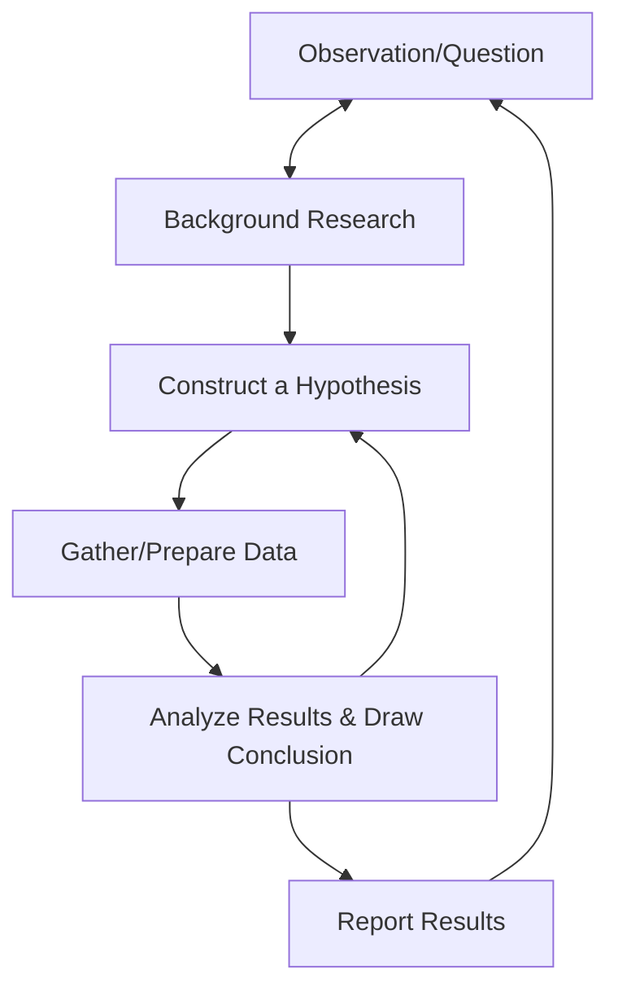
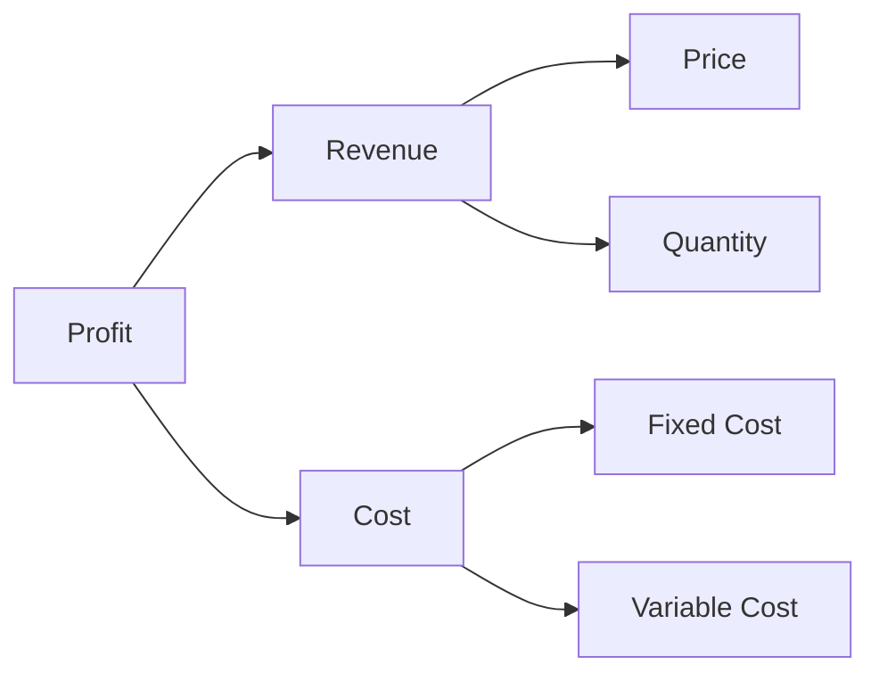

When people hear the word “science,” they usually think of lab coats, test tubes, or rocket launches. But science is much broader than any one subject—it’s a way of thinking. It’s about asking questions, testing ideas, and learning from evidence.

In data science, we don’t study chemical reactions or black holes. But we do use the **scientific method** every day—to make better decisions, solve real-world problems, and discover what the data actually says.

---

## Science, Defined

> **Science (n):** a systematic study of the structure and behavior of the world through observations, experimentation, and the testing of theories against the evidence observed.  
> — *Oxford Dictionary*

In simpler terms, **science is a structured process of asking questions and using data to find answers**. That’s why it’s at the heart of every good data project.

---

## The Scientific Method: Step by Step

Here’s how the scientific method typically works:

1. **Observation** – You notice something interesting or strange.
2. **Background Research** – You find out what’s already known.
3. **Hypothesis** – You come up with a testable explanation.
4. **Data Collection & Preparation** – You gather evidence, to support or refute the hypothesis.
5. **Analysis** – You analyze the data to confirm or reject your hypothesis.
6. **Report & Act** – You communicate your findings and take action.

These steps are **iterative**—you often loop back, revise your ideas, or collect more data. The diagram below shows how that cycle works:

---

### An Everyday Example

Let’s say you’re a student preparing for exams.

- You **observe** that studying in the morning helps you remember more.
- You do some **background research** by asking friends, reading about productivity, watching YouTube clips on productivity or asking ChatGPT or Gemini.
- You form a **hypothesis**: “Studying before noon leads *you* to better recall of the materials studied.”
- You study 10 new words a day and test how much you remember the next morning.You **track** your study time and quiz scores over a semester.
- You **analyze** the data.
- You **decide** to make morning study your default.

That’s science. You systematically studied your behavior through observations, and tested whether you are a morning person given the evidence observed.

Now, what if you don’t even know where to start? Here are two starting points.

---

## First Principles Thinking: Asking Better Questions

**First principles thinking** is a technique widely used by physicist and made famous by engineers and innovators like Elon Musk. It’s about breaking problems down into their most basic truths—then reasoning up from there.

Instead of saying “This is how we’ve always done it,” you ask:

- What do we *know* for sure?
- What *assumptions* are we making?
- What’s the most logical path forward, starting from the ground up?

This mindset pairs perfectly with science. Instead of copying others, you rebuild your understanding from core facts.

---

## MECE Thinking: From Consulting to Data Science

In business and data projects, another useful framework is **MECE**—Mutually Exclusive, Collectively Exhaustive. It helps you break down problems into **non-overlapping** and **complete** parts.

Let’s say a company notices that profits are falling. To investigate:

1. You split the problem into **Revenue** and **Cost** (mutually exclusive).
2. Under Revenue, you split into **Price** and **Quantity Sold**.
3. Under Cost, you split into **Fixed** and **Variable Costs**.

This gives you a clean, complete breakdown—-ready for data analysis.

Now you can form **specific hypotheses**:

- “Maybe our shipping costs have gone up.”
- “Maybe we’re selling fewer items in one region.”
- “Maybe our discounts are too aggressive.”

Then gather the data and test each one--just like a scientist.

Of course you can, and should, go further down the tree to completely understand the root cause before taking an action. For example, if data shows supplier costs have risen, the company need to examine that is due to prices of raw inputs have risen or the supplier has increase price without any fundamental changes. Then the company may negotiate new contracts or switch vendors. 

---

## Science Is Iterative

Scientific knowledge is dynamic. New evidence can refine or even over turn previous theories.

Early on, physicians studying Tobacco fostered the use of the plant and even believed there were medicinal properties. Of course, we now are well aware of the harmful effect of smoking. And as we will study later, using incorrect data science tools could lead the data scientist to actually conclude smoking is healthy. 

What is important is that we make the best decision possible given data and theories we have, and continue to re-evaluate and develop the theories. Good science, and good data science, always accounts for **confounding factors**, **alternative explanations**, and **new evidence**.

---

## Why This Matters for You

If you want to work with data—whether you're a student, a manager, or a full-time analyst-—you need to think like a scientist:

- Start with a clear, testable question.
- Break it down with MECE or first principles.
- Use evidence (data) to test your ideas.
- Stay open to revising your conclusions.

In the next post, we’ll finally put it all together and define **data science**—not just as a buzzword, but as a mindset and a method that combines everything we’ve seen so far.

